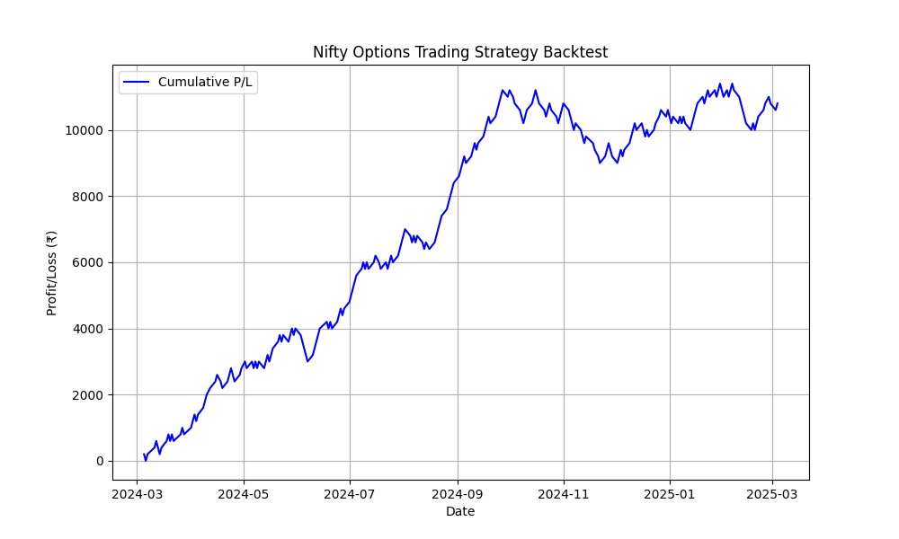

# Nifty Options Trading AI

This project implements an AI-driven trading strategy for Nifty options. It uses historical Nifty index data to backtest a simple options selling strategy based on market volatility. The strategy evaluates daily price movements and executes trades accordingly, providing performance metrics and visualization of cumulative profits.

## Strategy Overview
The strategy involves:
- Selling At-the-Money (ATM) +1% Call and Put Options when the market movement is less than 1%.
- Targeting a net profit of ₹100 per trade on both Call and Put positions.

## Key Features
- **Automated Backtesting:** Analyze historical Nifty data with a rule-based trading strategy.
- **Performance Metrics:** Gain insights into total trades, win rate, and final profit/loss.
- **Visualization:** Visualize the cumulative P/L over time with matplotlib.

## Trade Data
- **Total Trades:** 248
- **Winning Trades:** 151
- **Win Rate:** 60.89%
- **Final P/L:** ₹10,800.00



## How It Works
1. Load historical Nifty data.
2. Calculate daily market movement.
3. Execute trades based on volatility.
4. Aggregate and visualize performance.
5. Generate performance metrics.

## Usage
```bash
python backtest_strategy.py
```

## Requirements
Install dependencies using:
```bash
pip install -r requirements.txt
```

## Future Improvements
- Introduce AI-driven predictions for market movements.
- Implement advanced options strategies (e.g., iron condors, straddles).
- Automate live trading with broker APIs.

## Contributing
Feel free to fork the repository and submit pull requests for improvements!

## License
This project is licensed under the MIT License.

